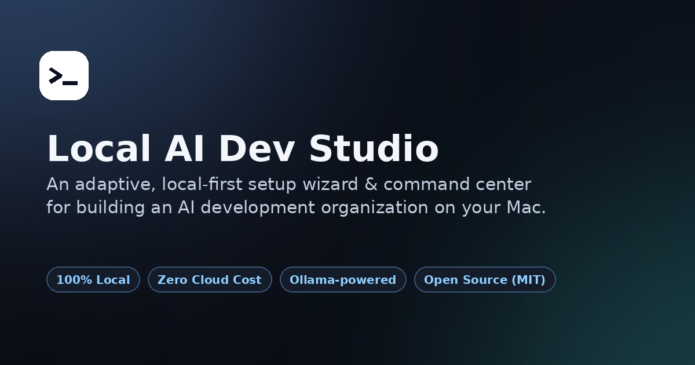
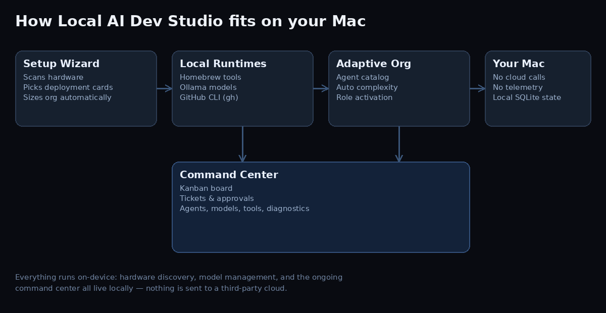

<div align="center">

# Dispatch

**A local-first setup wizard and command center that builds an adaptive AI development organization on your Mac — no cloud, no subscription, no telemetry.**

[](LICENSE)
[](#requirements)
[](#requirements)
[](#why-local-first)
[](#contributing)

[Live site](https://jowen82.github.io/dispatch/) · [Quick start](#quick-start) · [FAQ](#faq)

</div>

<br>



## What is Dispatch?

Dispatch is a macOS setup wizard and ongoing command center for running an **AI-assisted software development organization entirely on your own machine**. It scans your hardware, recommends the right local models for your available RAM, installs only the developer tools you're missing, and builds an "adaptive organization" of specialist agent roles sized to the deployment targets you pick — iOS, macOS, web, Android, game, full-stack, or AI/ML. Everything after setup lives in a Command Center: a drag-and-drop kanban board, a service desk, change approvals, project files, and a live agent roster that talks to a real, locally running [Hermes Agent](https://hermes-agent.nousresearch.com/).

It's built for developers, MSPs, and small teams who want the leverage of an AI development org without sending code, prompts, or infrastructure data to a third-party cloud.

## Why local-first?

- **Zero cloud cost.** Models run through [Ollama](https://ollama.com) on your own Apple Silicon; there's no per-token bill.
- **No telemetry.** State lives in a local SQLite database under `~/Dispatch/`. Nothing phones home.
- **You keep control.** Model removal requires typing the exact model name to confirm. Tool installs and model pulls show a live progress bar with an estimated time remaining.
- **Right-sized automatically.** Pick the deployment targets you're shipping to as cards — the studio decides organization complexity and role count for you.

## Features

- **Hardware & tool discovery** — chip, RAM, free disk, Homebrew, Ollama, Hermes, GitHub CLI, Node, and security tooling (`semgrep`, `gitleaks`, `osv-scanner`), all with a progress bar and ETA while scanning.
- **Model recommendation engine** — proposes a general, coding, and embedding model matched to your available unified memory, and evaluates any models you already have installed.
- **Multi-select deployment cards** — choose every platform you're shipping to; complexity and headcount are derived, not configured.
- **Adaptive agent organization** — a large dormant agent catalog activates only the roles relevant to your selected deployment targets and computed complexity.
- **Command Center** — kanban board, service-desk tickets, change approvals, a project list with real detail views (description, archive, delete, agent assignment, file attachments), and a live agent roster, all backed by local SQLite.
- **Local, frontier, or hybrid models** — choose during setup whether agents run on local Ollama models, hosted frontier models, or a mix per role.
- **Real Hermes integration** — finishing setup auto-creates a Hermes profile (with a role-specific persona) for every agent in your roster when the `hermes` CLI is available, and every Command Center action — tasks, tickets, approvals, and uploaded project files — is sent live to the right agent with `hermes send`. Each card shows whether Hermes actually received it.
- **Project attachments** — drop an image, document, or any file onto a project and Dispatch hands it straight to the assigned agent, alongside a durable file-based audit trail if Hermes isn't running.
- **Redacted diagnostics** — one-click support report with secrets and tokens stripped out.

## Quick start

```bash
git clone https://github.com/jowen82/dispatch.git
cd dispatch
chmod +x bootstrap.command
./bootstrap.command
```

Or double-click `bootstrap.command` in Finder. The wizard opens at `http://127.0.0.1:8787`. Setup state persists under `~/Dispatch/`, so `run.command` resumes where you left off — including reopening the Command Center.

### Requirements

- macOS (Apple Silicon recommended)
- Python 3.9+
- [Homebrew](https://brew.sh) for tool installs
- [Ollama](https://ollama.com) for local models (the wizard will tell you if it's missing)
- [Hermes Agent](https://hermes-agent.nousresearch.com/) with the `hermes` CLI on PATH, if you want live agent dispatch (optional — everything else works without it)

## How it works



See [ARCHITECTURE.md](ARCHITECTURE.md) for the full design notes, including the Hermes integration and the agent-catalog activation model.

## FAQ

**Is this free?**
Yes. Dispatch is MIT-licensed and free to use, fork, and modify. The only costs are whatever local models and disk space you choose to install.

**Does it send my code or prompts to the cloud?**
No. Model inference runs locally through Ollama, agent dispatch runs locally through Hermes, and all studio state (projects, tickets, approvals, agent roster, uploaded files) is stored on your Mac.

**What platforms can it plan for?**
iOS, macOS, web, Android, game development, full-stack, and AI/ML — selectable as multiple deployment-type cards in the Setup Wizard.

**Do I need a powerful Mac to run it?**
No. The model recommender scales its suggestions to your available RAM, from lightweight 4B-class models up to larger models on 24GB+ machines.

**Can I remove a model it installed?**
Yes, but only with an explicit confirmation step — you must type the exact model name before it's removed. Nothing is deleted automatically.

**What is the Command Center?**
The ongoing dashboard the Setup Wizard opens once setup is complete: a kanban board, service-desk tickets, approvals, projects (with file attachments), the active agent roster, and diagnostics — all in one place, separate from the wizard.

**Does it actually talk to Hermes, or just queue files?**
Both. When the `hermes` CLI is on PATH, Dispatch sends live via `hermes send --to <agent>` and shows you the real result on every card. Either way, every action is also mirrored into a file-based inbox as a durable audit trail, so nothing is lost if Hermes isn't running.

## Contributing

Issues and pull requests are welcome. Please run `pytest tests/` before submitting a PR.

## License

[MIT](LICENSE) © Jeff Owen
